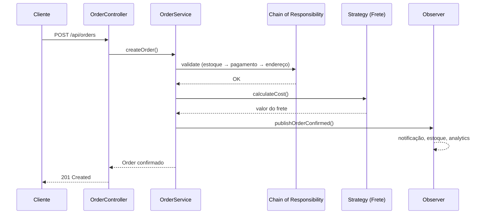

# Sistema de Pedidos — Design Patterns

API REST em **Spring Boot** que simula um fluxo de e-commerce: criação de pedidos, cálculo de frete, validações e notificações pós-confirmação. O foco é demonstrar **Padrões de Projeto (GoF)** de forma prática e documentada para portfólio.

## Padrões implementados

| Padrão | Onde | Por quê |
|--------|------|---------|
| **Strategy** | `pattern/strategy/` | Cada tipo de frete (PAC, SEDEX, Retirada) tem algoritmo próprio de cálculo, trocável em runtime |
| **Chain of Responsibility** | `pattern/chain/` | Validações (estoque → pagamento → endereço) encadeadas; cada handler decide ou repassa |
| **Factory Method** | `pattern/factory/` | Criação de notificações (E-mail, SMS, Push) sem expor classes concretas ao cliente |
| **Observer** | `pattern/observer/` | Após confirmação, múltiplos listeners reagem (notificação, estoque, analytics) |
| **Singleton** | `pattern/singleton/` | Configurações globais da app (`ApplicationSettings`) com instância única via enum |

## Tecnologias

- Java 17
- Spring Boot 3.3
- Maven
- SpringDoc OpenAPI (Swagger UI)

## Como rodar

**Pré-requisitos:** JDK 17+ e Maven instalados.

```bash
cd sistema-pedidos
mvn spring-boot:run
```

A API sobe em `http://localhost:8080`.

- Swagger UI: http://localhost:8080/swagger-ui.html
- OpenAPI JSON: http://localhost:8080/api-docs

## Endpoints

| Método | Rota | Descrição |
|--------|------|-----------|
| `POST` | `/api/orders` | Cria um pedido (validação + frete + eventos) |
| `GET` | `/api/orders/{id}` | Consulta pedido por ID |
| `GET` | `/api/shipping/options` | Lista opções de frete com preço estimado |
| `GET` | `/api/settings` | Exibe configurações globais (Singleton) |

## Exemplo de requisição

```bash
curl -X POST http://localhost:8080/api/orders \
  -H "Content-Type: application/json" \
  -d '{
    "items": [
      {
        "productId": "PROD-001",
        "productName": "Camiseta Dev",
        "quantity": 2,
        "unitPrice": 49.90
      }
    ],
    "address": {
      "street": "Rua das Flores, 123",
      "city": "São Paulo",
      "state": "SP",
      "zipCode": "01310-100"
    },
    "shippingType": "SEDEX",
    "paymentMethod": "PIX",
    "notificationType": "EMAIL",
    "customerEmail": "dev@email.com"
  }'
```

### Produtos em estoque (simulado)

| ID | Quantidade |
|----|------------|
| PROD-001 | 50 |
| PROD-002 | 30 |
| PROD-003 | 10 |
| PROD-004 | 5 |

### Formas de pagamento aceitas

`CREDITO`, `DEBITO`, `PIX`, `BOLETO`

## Fluxo do pedido



## Estrutura do projeto

```
src/main/java/com/portfolio/pedidos/
├── controller/          # REST API
├── service/             # Orquestração dos padrões
├── domain/              # Entidades e enums
├── dto/                 # Request/Response
├── pattern/
│   ├── strategy/        # Cálculo de frete
│   ├── chain/           # Validação de pedidos
│   ├── factory/         # Criação de notificações
│   ├── observer/        # Eventos pós-confirmação
│   └── singleton/       # Configurações globais
├── config/              # Bootstrap Spring
└── exception/           # Tratamento de erros
```

## Autor

Projeto desenvolvido como entrega do desafio final de **Padrões de Projeto (Design Patterns)**.
